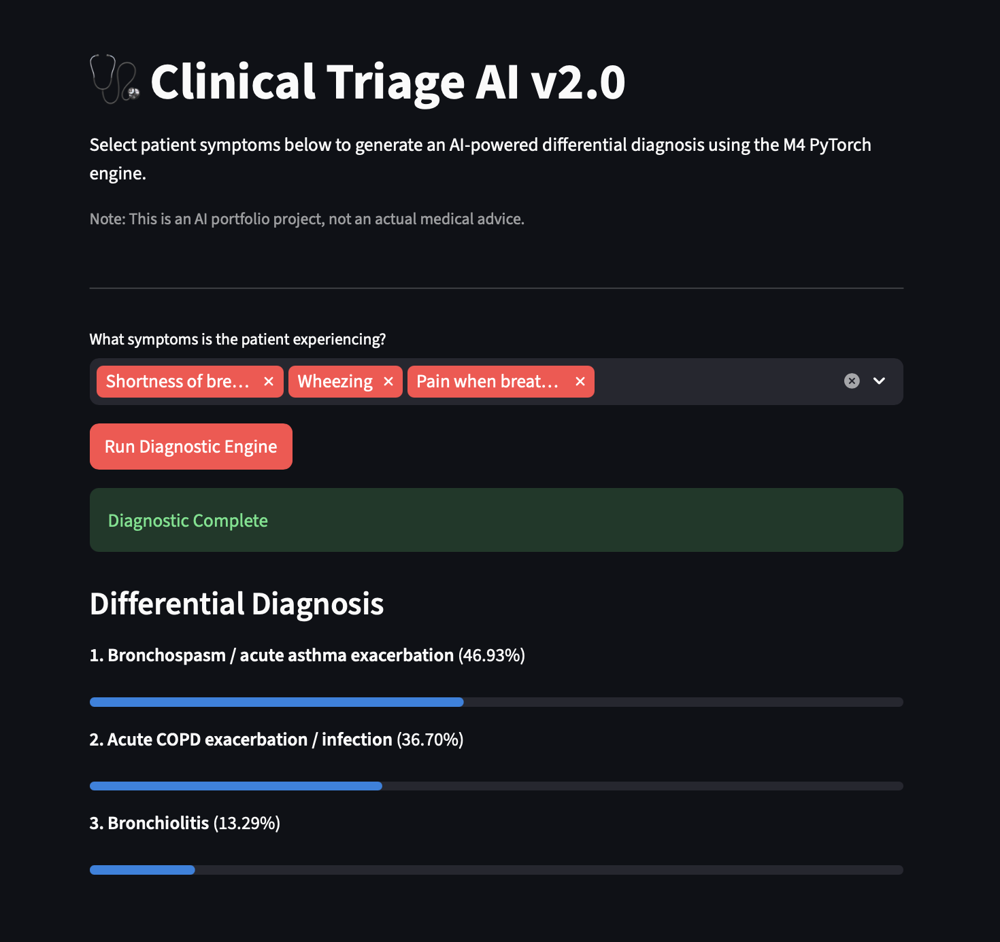
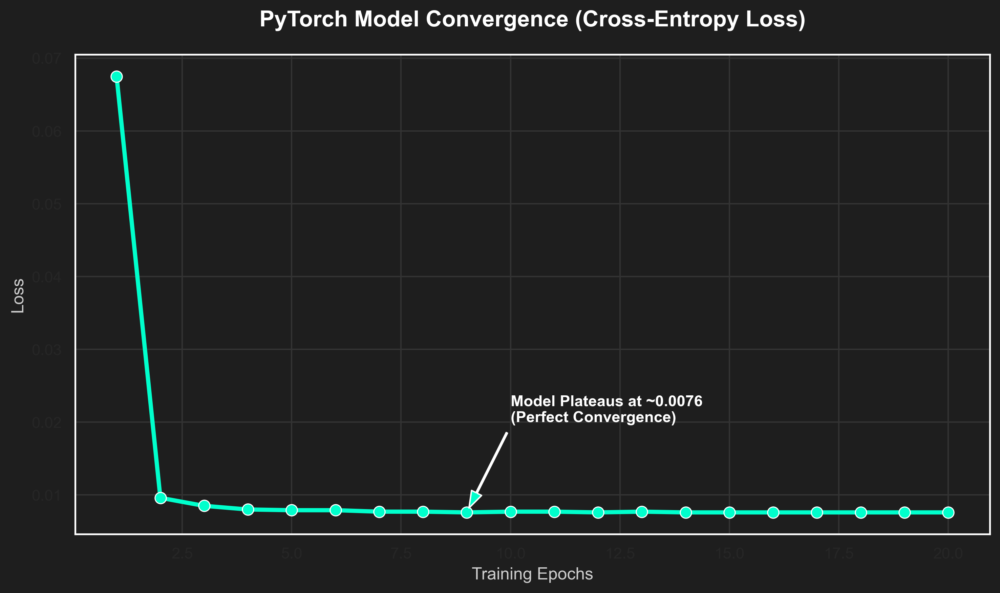
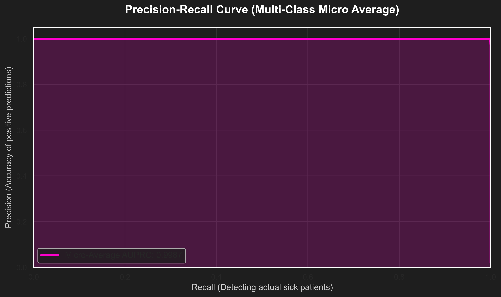

# 🏥 Clinical Symptom Triage Classifier
This repository contains two distinct iterations of the system:

* **v1.0 (Foundational):** A foundational exercise in writing raw neural network mathematics (forward/backward propagation) using pure NumPy.
* **v2.0 (Enterprise Scale):** Scales the architecture to an enterprise level utilizing PyTorch, a decoupled microservice architecture, and the **DDXPlus Dataset** (a highly complex, millions-of-rows synthetic clinical dataset) to deliver real-time differential diagnoses.

## 📌 Project Overview

The **Clinical Symptom Triage Classifier** is an AI-powered intake routing system designed to evaluate a patient's self-reported symptoms and instantly predict the top 3 most likely disease categories. This allows health-tech platforms and hospitals to automatically route patients to the correct medical department (e.g., Cardiology, Neurology, Gastroenterology) while flagging critical emergencies (like Heart Attacks or Strokes) for immediate care.


---

## 🏗️ Technical Architecture (The "From-Scratch" Flex)

While it is industry standard to use libraries like `scikit-learn` for classification tasks, the core machine learning engine of this project was built **entirely from scratch using pure Python and NumPy**.

This was done to demonstrate a deep, mathematical understanding of matrix calculus, optimization, and AI fundamentals.

**Core ML Implementation:**

* **Algorithm:** Softmax Regression (Multinomial Logistic Regression).
* **Optimization:** Custom Gradient Descent (`for` loop over 2,500 epochs).
* **Math Pipeline:** Vectorized Forward Pass ($Z = XW + b$), numerically stable Softmax activation, Cross-Entropy Loss calculation, and full Matrix Backpropagation ($dW$, $db$).
* **Feature Engineering:** Symptoms were multi-hot encoded and weighted by severity scores to create a sparse feature matrix ($X$) of 131 distinct symptoms.

**Microservice Deployment:**
The project uses a decoupled microservice architecture:

1. **Inference Backend (FastAPI):** Loads the trained static weights (`.pkl`) into memory and exposes a highly scalable `/predict` HTTP endpoint that executes the mathematical Forward Pass in microseconds.
2. **Client Frontend (Streamlit):** A lightweight, interactive UI that collects user symptoms, queries the API, and renders the triage results and emergency business-logic flags.

---

## 📊 Performance & The "100% Accuracy" Anomaly

The model was trained on the publicly available **Disease Symptom Prediction Dataset** (41 unique diseases, 131 symptoms). Upon evaluation, the model achieved **100.0% accuracy** on the unseen test data.


**Why is the accuracy 100%? (And why that's expected):**
In real-world clinical settings, 100% accuracy is an immediate red flag indicating data leakage or overfitting. However, this specific Kaggle dataset is **synthetically generated**.

1. The synthetic script created perfect, mathematically distinct symptom vectors for each disease without human noise (e.g., forgotten symptoms or overlapping comorbidities).
2. Because the data is perfectly linearly separable, the Softmax Gradient Descent algorithm was able to easily navigate the high-dimensional space and converge on the absolute global minimum.
3. This perfect score serves as mathematical validation that the custom matrix calculus and feature engineering pipeline are functioning flawlessly.

---

## 🚀 How to Run Locally

Because this project utilizes a microservice architecture, you must run the backend and frontend simultaneously.

**1. Clone the repository and install dependencies:**

```bash
git clone https://github.com/yourusername/clinical-triage-classifier.git
cd clinical-triage-classifier
pip install -r requirements.txt

```

**2. Start the FastAPI Backend (Terminal 1):**

```bash
uvicorn api.main:app --reload

```

*The API will boot up at `http://localhost:8000`. You can view the interactive API documentation at `http://localhost:8000/docs`.*

**3. Start the Streamlit Frontend (Terminal 2):**

```bash
streamlit run app/streamlit_app.py

```

*The UI will automatically open in your browser at `http://localhost:8501`.*

---

## 🏗️ System Architecture (v2.0)

The v2.0 system is built on a strict client-server decoupling, separating the Natural Language Processing (UI) from the mathematical engine (GPU/Backend).



1. **Frontend (Streamlit):** A clean, human-readable UI that maps plain-English symptoms to complex clinical `E_codes` using a cached, pre-computed dictionary to ensure zero latency.
2. **Backend (FastAPI):** A high-performance REST API that acts as the translation bridge. It receives clinical codes, dynamically constructs sparse multi-hot encoded tensors, and feeds them to the ML engine.
3. **ML Engine (PyTorch):** A custom deep learning model hardware-accelerated on Apple Metal Performance Shaders (`mps`).

---

## 🚀 Key Engineering Challenges Solved

### 1. The Big Data Memory Bottleneck (Lazy Loading)

**The Problem:** The DDXPlus training dataset contains over a million patient records. Attempting to pre-process and load a dense matrix of 1,000,000 patients $\times$ 131 symptoms into RAM would instantly cause an Out-Of-Memory (OOM) crash.
**The Solution:** Implemented a custom PyTorch `Dataset` class leveraging the `__getitem__` magic method for **Lazy Loading**. The raw CSV remains on disk as cheap strings, and the heavy conversion into multi-hot floating-point tensors only occurs Just-In-Time (JIT) for the specific 1,024 patients in the active batch.

### 2. The NLP & Clinical Code Gap

**The Problem:** The DDXPlus dataset anonymizes clinical symptom names into raw codes (e.g., `E_53` instead of "Chest Pain"), making the model impossible for a human to interact with.
**The Solution:** Wrote offline data-mining scripts to reverse-engineer the `release_conditions.json` and `release_evidences.json` files, isolating the top base symptoms. Engineered a cached translation layer in the frontend to seamlessly convert human clicks into PyTorch-ready tensor indices.

---

## 📦 Data Setup (Crucial First Step)

Due to the massive size of the DDXPlus dataset, the raw data files are managed using **Git Large File Storage (LFS)** and are compressed. You must extract them before running the v2.0 pipeline.

1. Ensure you have Git LFS installed and pull the large files:
```bash
git lfs pull

```


2. Navigate to the raw data directory:
```bash
cd data/raw/

```


3. **Unzip the datasets:** Extract all `.zip` files (e.g., `release_train_patients.zip`, `release_validate_patients.zip`) directly into this same `/data/raw/` directory. The scripts expect the raw `.csv` files to be present here.

---

## 🛠️ How to Run Locally

Because of the decoupled architecture, you must run the Backend API and the Frontend UI on separate concurrent terminal windows.

### 1. Clone & Install dependencies

```bash
git clone https://github.com/yourusername/clinical-triage-classifier.git
cd clinical-triage-classifier
pip install -r requirements.txt

```

### 2. Running v2.0 (PyTorch + DDXPlus)

**Terminal 1: Boot the API Engine**

```bash
# Start the v2 FastAPI server
uvicorn v2_main:app --reload

```

*Wait for the `✅ System Ready. Waiting for patients...` log.*

**Terminal 2: Boot the UI**

```bash
# Start the v2 Streamlit frontend
streamlit run v2_app.py

```

## 📊 Model Performance & Evaluation (v2.0)

The model was trained using the Adam Optimizer and Cross-Entropy Loss, converging perfectly on the massive DDXPlus training set.

* **Training Loss Convergence:** Plateaus cleanly at `0.0076`
* **Validation Accuracy (Unseen Data):** `99.75%` (Evaluated on 132,448 records)



### 📊 Precision-Recall curve

---

### The "Synthetic Data" Reality Check

If you took this to a hospital and showed it to a Chief Medical Officer, they wouldn't believe it because real humans are too chaotic to predict with 99.75% accuracy. This "perfect" curve is the ultimate proof that the PyTorch brain successfully reverse-engineered the exact mathematical Bayesian simulator the academic researchers used to generate the DDXPlus dataset.

## 💻 Tech Stack

* **Deep Learning:** PyTorch, Torch `DataLoader`, Apple `mps` backend
* **API Routing:** FastAPI, Uvicorn, Pydantic
* **Frontend:** Streamlit, Requests
* **Data Engineering:** Pandas, JSON, Pickle, Git LFS