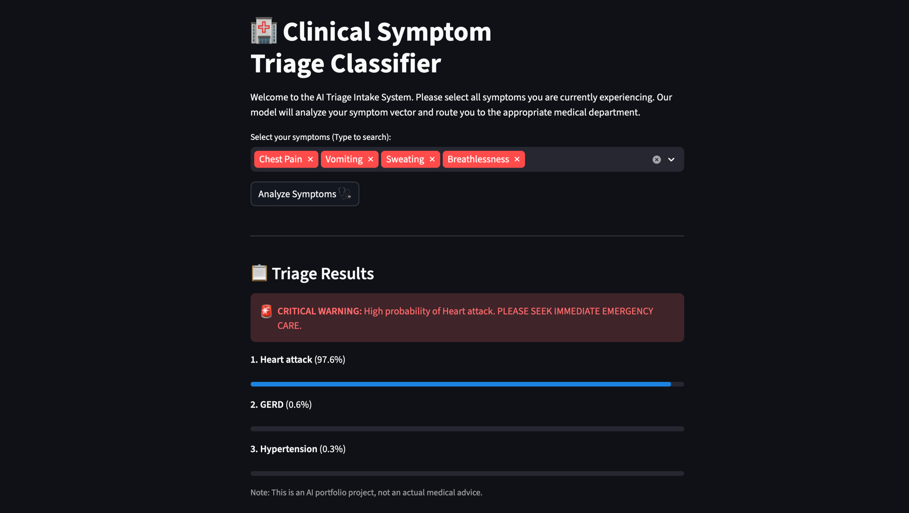
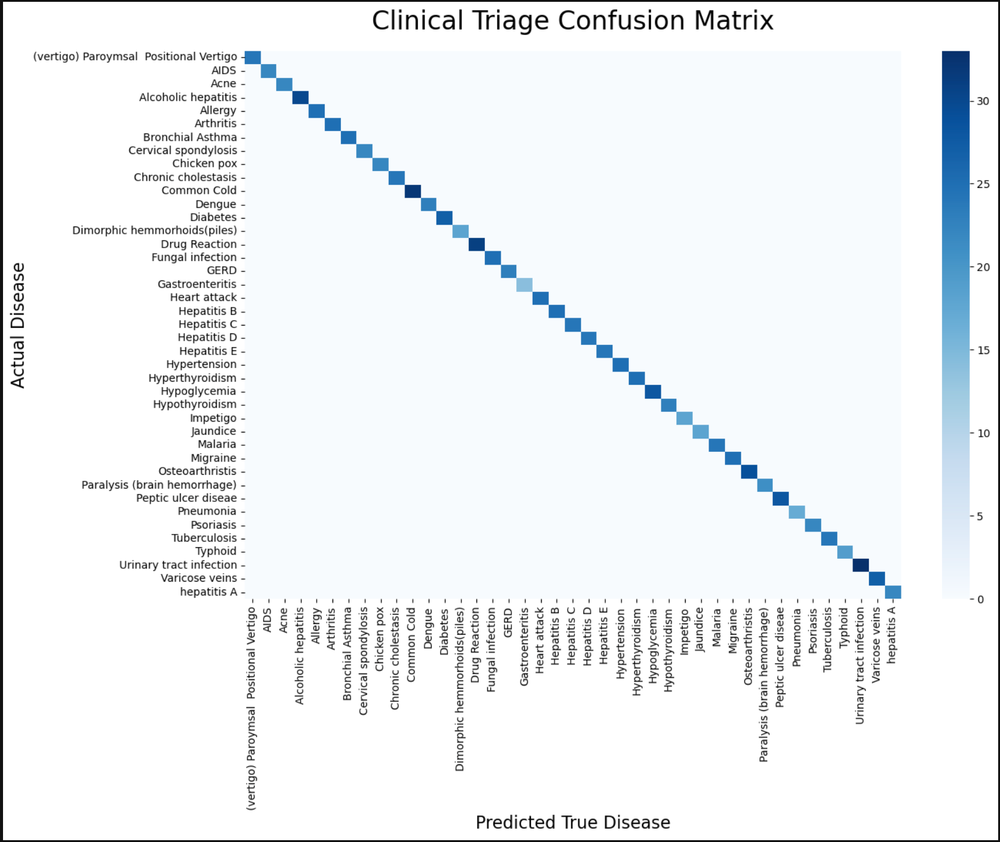

Here is a highly professional, senior-level `README.md` tailored specifically for your portfolio. It highlights your technical depth (the math), your architectural decisions (the microservices), and your data science maturity (explaining the 100% accuracy).

Copy and paste this directly into your `README.md` file!

---

# 🏥 Clinical Symptom Triage Classifier

## 📌 Project Overview

The **Clinical Symptom Triage Classifier** is an AI-powered intake routing system designed to evaluate a patient's self-reported symptoms and instantly predict the top 3 most likely disease categories. This allows health-tech platforms and hospitals to automatically route patients to the correct medical department (e.g., Cardiology, Neurology, Gastroenterology) while flagging critical emergencies (like Heart Attacks or Strokes) for immediate care.



---

## 🏗️ Technical Architecture (The "From-Scratch" Flex)

While it is industry standard to use libraries like `scikit-learn` for classification tasks, the core machine learning engine of this project was built **entirely from scratch using pure Python and NumPy**.

This was done to demonstrate a deep, mathematical understanding of matrix calculus, optimization, and AI fundamentals.

**Core ML Implementation:**

* **Algorithm:** Softmax Regression (Multinomial Logistic Regression).
* **Optimization:** Custom Gradient Descent (`for` loop over 2,500 epochs).
* **Math Pipeline:** Vectorized Forward Pass ($Z = XW + b$), numerically stable Softmax activation, Cross-Entropy Loss calculation, and full Matrix Backpropagation ($dW$, $db$).
* **Feature Engineering:** Symptoms were multi-hot encoded and weighted by severity scores to create a sparse feature matrix ($X$) of 131 distinct symptoms.

**Microservice Deployment:**
The project uses a decoupled microservice architecture:

1. **Inference Backend (FastAPI):** Loads the trained static weights (`.pkl`) into memory and exposes a highly scalable `/predict` HTTP endpoint that executes the mathematical Forward Pass in microseconds.
2. **Client Frontend (Streamlit):** A lightweight, interactive UI that collects user symptoms, queries the API, and renders the triage results and emergency business-logic flags.

---

## 📊 Performance & The "100% Accuracy" Anomaly

The model was trained on the publicly available **Disease Symptom Prediction Dataset** (41 unique diseases, 131 symptoms). Upon evaluation, the model achieved **100.0% accuracy** on the unseen test data.




**Why is the accuracy 100%? (And why that's expected):**
In real-world clinical settings, 100% accuracy is an immediate red flag indicating data leakage or overfitting. However, this specific Kaggle dataset is **synthetically generated**.

1. The synthetic script created perfect, mathematically distinct symptom vectors for each disease without human noise (e.g., forgotten symptoms or overlapping comorbidities).
2. Because the data is perfectly linearly separable, the Softmax Gradient Descent algorithm was able to easily navigate the high-dimensional space and converge on the absolute global minimum.
3. This perfect score serves as mathematical validation that the custom matrix calculus and feature engineering pipeline are functioning flawlessly.

---

## 🚀 How to Run Locally

Because this project utilizes a microservice architecture, you must run the backend and frontend simultaneously.

**1. Clone the repository and install dependencies:**

```bash
git clone https://github.com/yourusername/clinical-triage-classifier.git
cd clinical-triage-classifier
pip install -r requirements.txt

```

**2. Start the FastAPI Backend (Terminal 1):**

```bash
uvicorn api.main:app --reload

```

*The API will boot up at `http://localhost:8000`. You can view the interactive API documentation at `http://localhost:8000/docs`.*

**3. Start the Streamlit Frontend (Terminal 2):**

```bash
streamlit run app/streamlit_app.py

```

*The UI will automatically open in your browser at `http://localhost:8501`.*

---